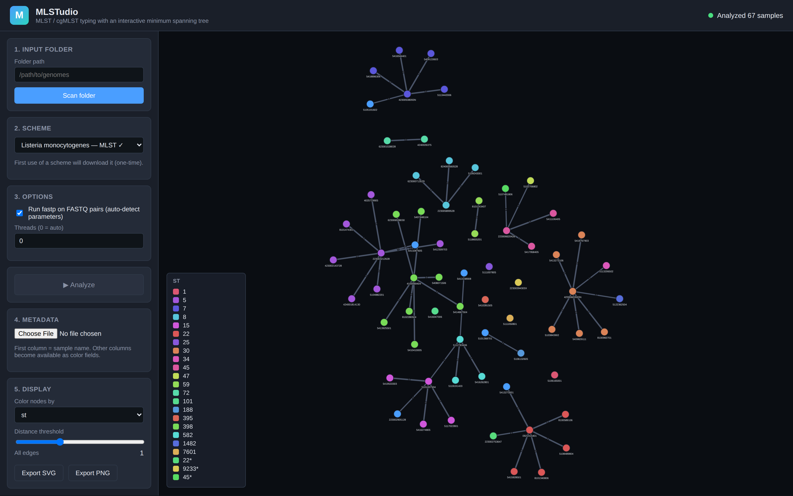

# MLSTudio

**A polished, open-source Linux tool for MLST / cgMLST typing with an interactive Minimum Spanning Tree viewer.**

> Status: **active development**. End-to-end MLST pipeline + WebUI working today; cgMLST and read-backed rescue land next. See [ROADMAP.md](ROADMAP.md).

---

## What it does

Point it at a folder of assembled bacterial genomes (and optionally their paired-end Illumina reads). It pulls the appropriate typing scheme from public databases, calls alleles with BLAST across all available cores, assigns Sequence Types, computes pairwise allele distances, and renders an interactive minimum spanning tree in your browser — with live threshold filtering, metadata-driven coloring, and publication-quality export.

- **Auto-downloads typing schemes** from PubMLST.org and BIGSdb-Pasteur, version-pinned and cached locally
- **Multicore BLAST** for fast allele calling on dozens to hundreds of genomes
- **fastp QC** on paired-end FASTQs with sequencing-data-aware auto-tuned parameters
- **Interactive MST** — drag nodes, slide a threshold to collapse close clusters, color by any metadata field, export PNG
- **Metadata-aware** — upload a simple CSV and re-color the tree on the fly
- **Local-only** — runs entirely on your machine, no cloud, no telemetry
- **One-shot install** — `./setup.sh` provisions a conda environment with every external tool (BLAST+, Bowtie2, samtools, fastp, seqkit)

## What it is *not*

- Not a genome assembler — input is assembled contigs (and optionally short reads for the rescue step).
- Not Windows / macOS — Linux only by design.

## Screenshots


*The welcome screen — point at a folder, pick a scheme, click **Analyze**.*


*Interactive minimum spanning tree of 67 Staphylococcus aureus isolates, colored by Sequence Type. Drag nodes, scroll to zoom, click for details. The clusters of identical-color nodes are clonal groups (e.g. ST 398, ST 5, ST 22).*



*The distance threshold slider hides edges above the chosen allele-difference cutoff — making clonal groups pop out and revealing the true population structure at a glance.*


*The results panel: every isolate, its assigned ST, every per-locus allele call, and any flags. Inexact matches (`INF`) and novel allele combinations are surfaced explicitly — see ST `9233*` (inexact) and the row marked "novel allele combination — no matching ST".*

## Quickstart

```bash
# Clone and bootstrap (creates the `mlstudio` conda env with all bio + Python deps)
git clone https://github.com/iowa69/mlstudio.git && cd mlstudio
./setup.sh
conda activate mlstudio

# Pull a scheme once (e.g. S. aureus)
mlstudio schemes list --remote
mlstudio schemes pull saureus_mlst

# Smoke-test the caller on a single assembly
mlstudio call mlst --scheme saureus_mlst --input path/to/genome.fasta

# Launch the WebUI on a folder
mlstudio gui /path/to/folder
```

## Input layout

The folder you point the tool at can contain either FASTA-only or FASTA + matching paired-end FASTQs:

```
my_run/
├── isolate_001.fasta
├── isolate_001_R1.fastq.gz   ← optional
├── isolate_001_R2.fastq.gz   ← optional
├── isolate_002.fasta
└── isolate_002.fasta         ← FASTA-only is fine too
```

Supported read-pair naming patterns: `_R1_/_R2_`, `_1./_2.`, `.R1./.R2.`, `.1./.2.`. The sample name is the FASTA stem.

## Architecture

```
┌──────────────────────────────────────────────────────────┐
│  Browser (Cytoscape.js)                                  │
│   ├─ MST viewer (movable nodes, threshold slider)        │
│   ├─ Profile / metadata tables                           │
│   └─ Coloring & legend                                   │
└──────────────────────────┬───────────────────────────────┘
                           │  HTTP + WebSocket (localhost)
┌──────────────────────────▼───────────────────────────────┐
│  FastAPI backend (mlstudio.api)                          │
│   ├─ schemes/  — PubMLST + BIGSdb-Pasteur clients        │
│   ├─ calling/  — BLAST (multicore) + fastp + rescue*     │
│   ├─ profiles/ — Hamming distance, MST construction      │
│   └─ io/       — folder scanner, FASTQ pairing           │
└──────────────────────────┬───────────────────────────────┘
                           │  subprocess
                ┌──────────▼──────────┐
                │  BLAST+ · Bowtie2*  │
                │  samtools · fastp   │
                └─────────────────────┘
                  * cgMLST + rescue: roadmap M3
```

## Tech stack

- **Backend**: Python 3.11+, FastAPI, multiprocessing, NetworkX, NumPy, BioPython, pysam, httpx
- **Frontend**: HTML + ES2020 + Cytoscape.js (cose-bilkent layout), loaded from CDN — no Node toolchain required
- **Storage**: Local file cache for schemes + per-job in-memory state (SQLite persistence on the roadmap)
- **Packaging**: Conda env via `setup.sh` (Bioconda release on the roadmap)

## License

MIT — see [LICENSE](LICENSE).

## Author

Built by [@iowa69](https://github.com/iowa69).
