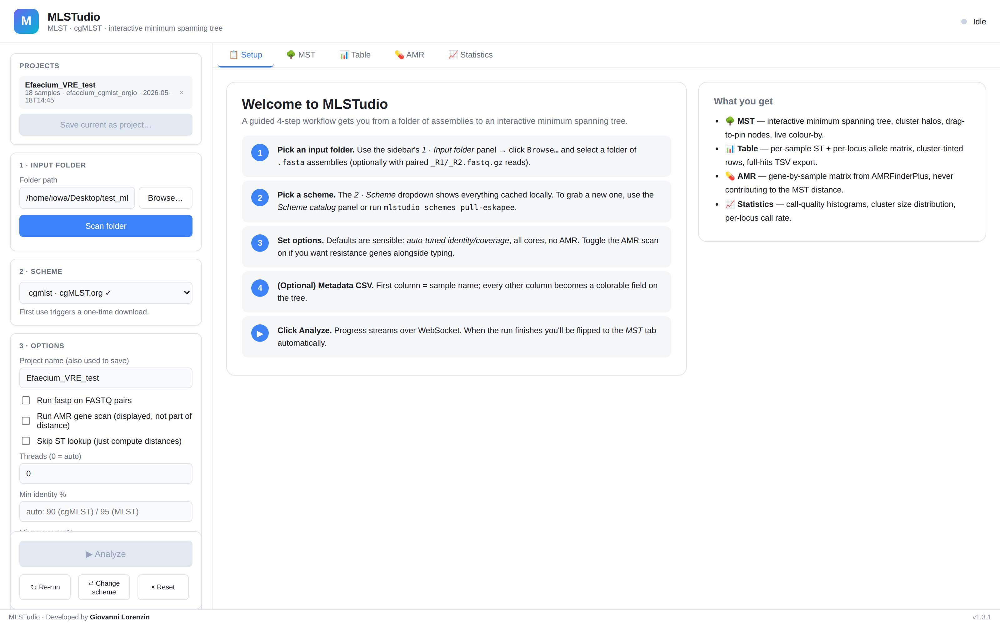
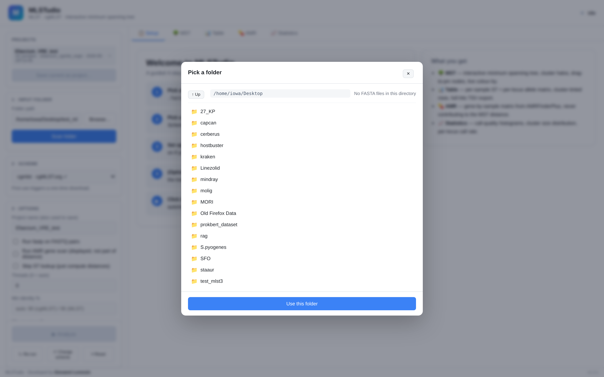
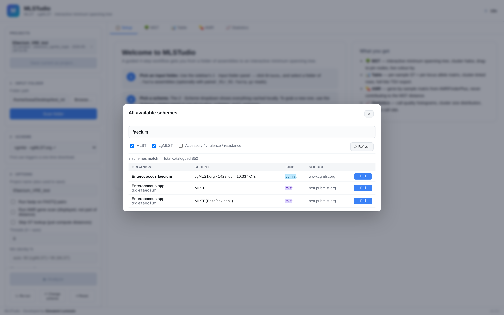
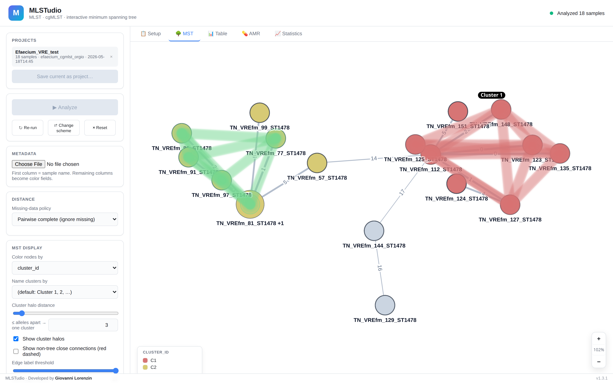
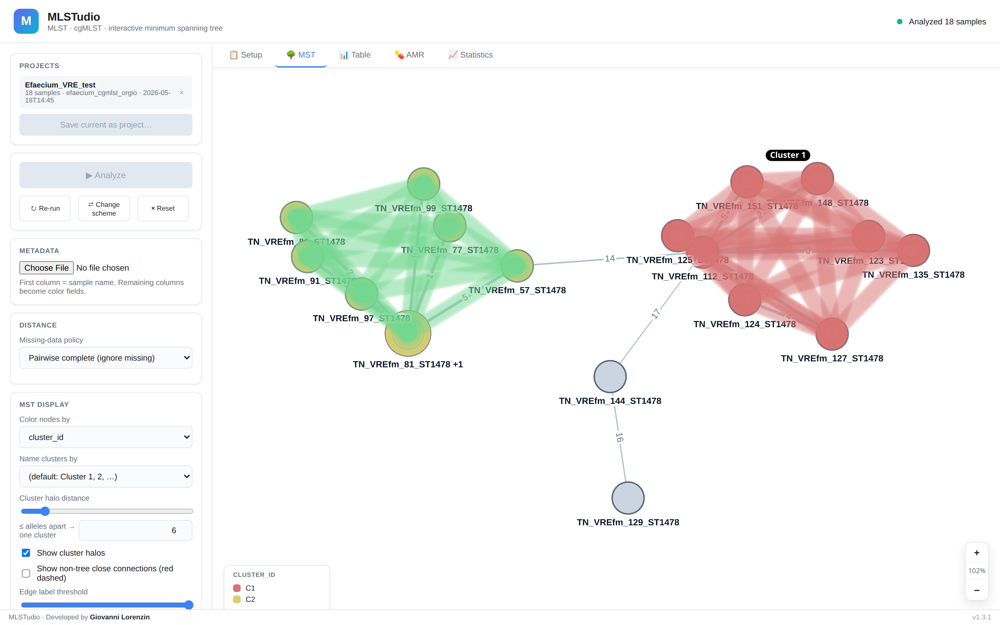
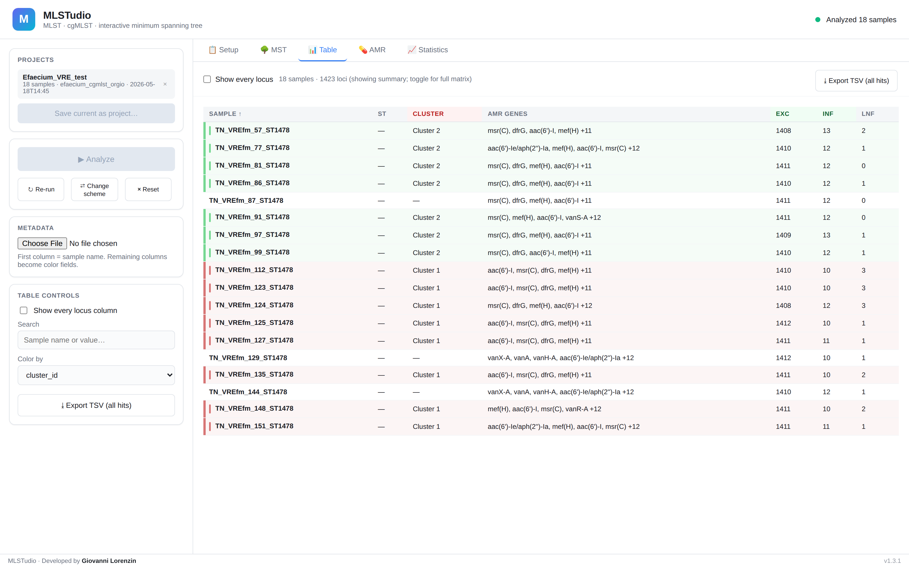
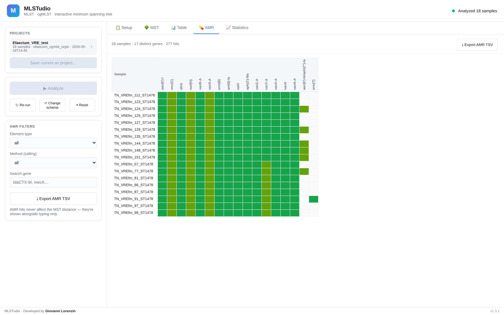

# MLSTudio

**Polished MLST / cgMLST typing for Linux with an interactive minimum spanning tree.**

Point it at a folder of assembled bacterial genomes, pick a scheme, and explore the population structure in your browser. Soft pastel clusters, drag-to-rearrange nodes, threshold-driven cluster halos, metadata-driven coloring, publication-quality export.

[Skip to the 60-second quickstart →](#60-second-quickstart)

---

## At a glance

MLSTudio is organised around **five tabs** at the top of the workspace. The sidebar swaps in contextual controls per tab so the surface stays clean. Every screenshot below is taken from the 18-isolate *Enterococcus faecium* VRE-ST1478 demo panel (cgMLST.org scheme, 1 423 loci).

### Setup tab — the guided workflow


The default landing page. A numbered checklist walks you through the four-step flow (folder → scheme → options → optional metadata → **Analyze**), and a second card summarises what each result tab will give you. The sidebar shows the input panels for those same four steps plus the **Re-run / Change-scheme / Reset** sticky-run actions.

### Folder picker

Click **Browse…** to navigate your filesystem inside the browser. Each folder shows how many FASTA files it contains before you commit.

### Scheme catalog

**Browse all PubMLST schemes…** live-queries PubMLST.org + BIGSdb-Pasteur + cgMLST.org. Filter by MLST / cgMLST / accessory; type to search across organism, scheme description, and database name. One click pulls the scheme into your local cache.

### MST tab — the interactive minimum-spanning tree

Edge length is proportional to allele distance, so visually close isolates really are genetically close. Drag any node to pin it (border turns amber), wheel-zoom, right-click-drag to pan, or use the floating **+ / % / −** zoom dial in the corner. Identical genotypes auto-collapse into a single pie-chart node sized by member count.

### MST tab — cluster halos

Slide the **cluster halo distance** up and outbreak-style groups appear as translucent coloured halos that hug the actual cluster shape (the union of soft circles around member nodes plus the connecting edges), with crisp pill labels on top. Isolates not in any cluster stay neutral grey so the eye goes to the real groups. The slider caps at 50 alleles (the cgMLST sweet spot); the numeric input next to it accepts arbitrarily larger values.

### Table tab — the comparison table

One row per sample with ST, cluster ID, EXC / INF / LNF counts, AMR genes, and the full per-locus allele matrix (toggle **Show every locus** for big schemes). Rows are tinted by cluster colour so outbreak groups are readable without opening the tree. **Export TSV** always writes the full per-locus matrix regardless of on-screen filtering.

### AMR tab — sample × gene matrix

AMRFinderPlus hits as a dense sample-by-gene grid. Cell colour encodes calling method: **green** for EXACT, **lime** for BLAST, **amber** for PARTIAL. Filter by element type (AMR / stress / virulence), by calling method, or by gene-name substring (`blaCTX-M`, `mecA`, `vanA`, …). **AMR results never feed the MST distance** — they are displayed alongside typing only.

### Statistics tab

Per-sample call quality (EXC / INF / LNF distribution), per-locus call rate, cluster size distribution, AMR gene frequency. Useful as the first artifact to share when discussing a run.

---

## Working with the tabs

Every analysis lives inside one project, and you move between five tabs depending on what you want to look at next. The **sidebar swaps automatically** to match — controls that only matter for the tree (cluster halo distance, layout algorithm, node-size scale) disappear when you flip to the Table tab, and the **AMR Filters / Statistics view** panels appear when you flip into those tabs.

| Tab | What you do here | Sidebar controls |
|-----|------------------|------------------|
| **Setup** | Pick the input folder, the scheme, options (threads / identity / coverage / AMR / fastp). Optional metadata CSV. Click ▶ Analyze. | Input folder · Scheme · Options · Metadata · Scheme catalog · Run / Re-run / Change-scheme / Reset |
| **MST** | Interactive minimum spanning tree. Drag nodes, zoom, click the **Cluster halo distance** slider to find outbreak groups, switch **Color nodes by** to a metadata field, tune layout. | Metadata · Distance (missing-data policy) · MST display (color, halos, layout algorithm, node / label / edge size, export PNG/SVG) |
| **Table** | Per-sample ST + per-locus allele matrix, cluster-tinted rows. **Show every locus** toggle. **Export TSV** dumps everything. | Metadata · Table controls (color-by mirror, search, full-locus toggle, TSV export) |
| **AMR** | AMRFinderPlus hits as a sample × gene matrix. Cell colour encodes calling method. AMR never affects the MST. | AMR filters (element type, calling method, gene-name search) · Export AMR TSV |
| **Statistics** | Call-quality histograms, cluster size distribution, AMR gene frequency. | Statistics view (overview / quality / loci / clusters) |

A finished analysis switches you to the **MST** tab automatically. From there you can:

1. Drag the **Cluster halo distance** slider until the outbreak clusters you care about light up. The number on each edge is the allele distance.
2. Drop a metadata CSV (sidebar → Metadata) and change **Color nodes by** to a column — wards, dates, phenotypes, anything. The same field also drives the row tinting on the Table tab and the legend.
3. Flip to the **AMR** tab to see resistance genotypes — vanA / vanB for VRE, mecA / mecC for MRSA, the carbapenemase family for CRE.
4. **Save current as project…** in the Projects panel stores the whole run (`.local/share/mlstudio/projects/<name>/` — manifest, MST, results, metadata, AMR) so you can reload it later in section 0 of the sidebar.

---

## 60-second quickstart

```bash
# Option A — Bioconda (recommended once the PR lands)
conda install -c bioconda mlstudio
amrfinder -u            # one-time, ~250 MB, only if you'll use the AMR scan
mlstudio gui

# Option B — from source
git clone https://github.com/iowa69/mlstudio.git && cd mlstudio
./setup.sh              # creates the `mlstudio` conda env with all bio + Python deps
conda activate mlstudio
pip install -e .        # editable install — source edits are picked up live
amrfinder -u            # one-time, ~250 MB, only if you'll use the AMR scan
mlstudio gui            # opens http://127.0.0.1:<port>/ in your default browser
```

> The first time you tick **Run AMR gene scan**, MLSTudio needs the AMRFinderPlus
> database to be present (`amrfinder -u` fetches it). Skipping that step is a
> common cause of "AMR=0 across the board" — the GUI will show a yellow banner
> on the AMR tab when this is the issue.

A browser window opens. From there:

1. **Browse** to a folder containing your `.fasta` assemblies (and optionally paired-end `_R1_/_R2_` FASTQs).
2. **Pick a scheme** from the dropdown. First use pulls and caches it from the public scheme database (PubMLST or BIGSdb-Pasteur).
3. (Optional) **Upload a metadata CSV** — first column = sample name, other columns become color fields.
4. Click **Analyze**. Progress streams in real-time over WebSocket.
5. When the run finishes, the MST renders. Slide the **cluster halo distance** to highlight outbreak clusters, change **Color nodes by** to any uploaded metadata field, and **Export PNG** when you're ready.

## How to organize your input folder

A folder you point MLSTudio at can be FASTA-only or FASTA + paired-end Illumina reads:

```
my_run/
├── isolate_001.fasta
├── isolate_001_R1.fastq.gz   ← optional, paired with isolate_001.fasta
├── isolate_001_R2.fastq.gz   ← optional
├── isolate_002.fasta         ← FASTA-only is fine
└── isolate_003.fna           ← .fa / .fna / .fasta all recognized
```

**Paired-end naming patterns recognized**: `_R1_/_R2_`, `_1./_2.`, `.R1./.R2.`, `.1.fastq/.2.fastq`. The sample name is the FASTA stem (stripped of `.contigs`, `.scaffolds`, `.assembly`, `.genomic`, `.asm` suffixes).

## Available schemes

The catalog (panel 6 in the sidebar) lists every scheme MLSTudio knows about. Click **Pull** next to one to cache it locally. Currently registered:

| Organism | Scheme | Source | Loci | Suggested cluster distance |
|----------|--------|--------|:---:|:---:|
| *Listeria monocytogenes* | MLST | BIGSdb-Pasteur | 7 | 0 |
| *Listeria monocytogenes* | cgMLST1748_v2 | BIGSdb-Pasteur | 1748 | 7 |
| *Staphylococcus aureus* | MLST | PubMLST | 7 | 0 |
| *Staphylococcus aureus* | cgMLST | PubMLST | 1716 | 5 |
| *Escherichia coli* | MLST (Achtman) | PubMLST | 7 | 0 |
| *Klebsiella pneumoniae* | MLST | BIGSdb-Pasteur | 7 | 0 |

Adding more schemes is a one-line edit to `src/mlstudio/schemes/bigsdb.py`'s `REGISTRY`.

### ESKAPEE cgMLST in one command

The seven [WHO-priority ESKAPEE](https://en.wikipedia.org/wiki/ESKAPE) nosocomial pathogens — *E. faecium, S. aureus, K. pneumoniae, A. baumannii, P. aeruginosa, Enterobacter (E. hormaechei), E. coli* — are the most-typed organisms in clinical microbiology. Pull all seven cgMLST schemes from [cgMLST.org](https://www.cgmlst.org/) at once:

```bash
mlstudio schemes pull-eskapee
```

Total download is roughly 1–2 GB. Everything is cached under `~/.local/share/mlstudio/schemes/` and reused across every subsequent analysis.

| Pathogen | cgMLST.org slug | Local key |
|----------|-----------------|-----------|
| *Enterococcus faecium* | `Efaecium` | `efaecium_cgmlst_orgio` |
| *Staphylococcus aureus* | `Saureus` | `saureus_cgmlst_orgio` |
| *Klebsiella pneumoniae* complex | `Kpneumoniae_complex` | `kpneumoniae_complex_cgmlst_orgio` |
| *Acinetobacter baumannii* | `Abaumannii` | `abaumannii_cgmlst_orgio` |
| *Pseudomonas aeruginosa* | `Paeruginosa` | `paeruginosa_cgmlst_orgio` |
| *Enterobacter hormaechei* | `Ehormaechei` | `ehormaechei_cgmlst_orgio` |
| *Escherichia coli* | `Ecoli` | `ecoli_cgmlst_orgio` |

### Offline / manual scheme install

If `pull-eskapee` fails — slow network, firewall, cgMLST.org temporarily down — there is a "legacy" offline tarball attached to each [GitHub release](https://github.com/iowa69/mlstudio/releases) of MLSTudio. It is a snapshot of the scheme cache produced on a healthy network by `scripts/bundle_eskapee_schemes.sh`.

Install it by hand:

```bash
# 1. Grab the tarball from the latest GitHub release
curl -LO https://github.com/iowa69/mlstudio/releases/latest/download/mlstudio-eskapee-schemes.tar.zst

# 2. Make sure the scheme cache directory exists
mkdir -p ~/.local/share/mlstudio/schemes

# 3. Untar it into the cache (one directory per scheme appears under ./schemes/)
tar --use-compress-program=unzstd -xf mlstudio-eskapee-schemes.tar.zst \
    -C ~/.local/share/mlstudio/schemes

# 4. Sanity check
mlstudio schemes list      # should now show all 7 cached ✓
```

You can also drop **any** custom or hand-built scheme into the cache by following the same layout. Every scheme directory has the shape:

```
~/.local/share/mlstudio/schemes/<key>/
├── manifest.json          # scheme metadata (organism, kind, loci, locus sha256s)
├── loci/                  # one FASTA per locus
│   ├── <locus1>.fasta
│   ├── <locus2>.fasta
│   └── …
└── profiles.tsv           # ST → allele profile table (cgMLST schemes ship a header-only file)
```

The minimum required for a working scheme is a valid `manifest.json` plus the per-locus FASTAs under `loci/`. The simplest way to produce one yourself is `mlstudio schemes build-adhoc --reference <ref.fasta> --key mygenus_v1 --organism "My genus"`.

The `MLSTUDIO_CACHE_DIR` environment variable overrides the cache location if you want schemes on a shared filesystem.

## Working with the tree

| Action | How |
|--------|-----|
| Drag a node | Click and hold — manually-placed nodes auto-lock (border turns amber) |
| Pan the canvas | Right-click drag |
| Zoom | Scroll wheel |
| Re-run the force layout | **Relax layout** button |
| Fit everything to screen | **Fit to screen** button |
| Hide edges above a distance | **Edge label threshold** slider |
| Group close isolates into a named hull | **Cluster halo distance** slider |
| Switch missing-data treatment | **Missing-data policy** dropdown — see below |
| Color by an uploaded field | **Color nodes by** dropdown |
| Toggle sample labels | **Show sample labels** checkbox |
| Export | **Export PNG** (high-DPI, white background) |

### Node pies for identical genotypes

When two or more samples share an *identical* allele profile they collapse into one node. With a metadata CSV uploaded, that node becomes a pie chart whose slices represent how the members are distributed across the selected color field — matching the convention used by professional MLST tools.

## Missing-data policy

When you have partial assemblies, some loci are LNF (locus not found). Three policies for how that affects pairwise distance — switch live from the sidebar; the MST is recomputed on the server in seconds:

| Policy | What it does | When to use |
|--------|--------------|-------------|
| **Pairwise complete** (default) | Only loci present in both isolates contribute. | Standard for cgMLST. |
| **Missing as own category** | Missing values form their own allele "value" — two missing loci are equal, missing vs called is a difference. | Recommended for smaller schemes (7-gene MLST, MLVA). |
| **Count missing as differences** | Every missing locus counts as one allele difference. | Conservative — pushes apart isolates with poor calling. |
| **Pairwise complete, scaled** | Pairwise-complete distance scaled to the full locus count: d × n_loci / n_shared. | Keeps the magnitude comparable across pairs with different overlap. |

The visual parameters (node size, edge thickness, label visibility) auto-tune to dataset size — from a handful of isolates up to 5000+ — so the tree stays legible on screens from a laptop to a 4K display.

## Output files

Every analysis writes to `<input_folder>/.mlstudio/` (or your chosen output folder):

- `summary.tsv` — one row per sample: ST, EXC/INF/LNF counts, notes
- `alleles.tsv` — full per-locus allele matrix (when the scheme has ≤200 loci)
- `mst.json` — Cytoscape.js-ready MST graph for re-use elsewhere
- `amr.tsv` — AMRFinderPlus hits, if you enabled the AMR scan

## CLI usage (no GUI needed)

```bash
mlstudio --help
mlstudio schemes list --remote          # what's available
mlstudio schemes pull saureus_cgmlst    # download a scheme
mlstudio call mlst   --scheme saureus_mlst   --input my_genome.fasta
mlstudio call cgmlst --scheme saureus_cgmlst --input my_genome.fasta -t 24
mlstudio gui /path/to/folder            # launch the UI, pre-filled
```

## Build an ad-hoc cgMLST scheme from a reference genome

No public scheme for your organism? Build one from a single annotated reference in **one command** — prodigal predicts CDS, self-BLAST drops paralogs, length filter trims fragments, and the scheme appears in your catalog ready to type against:

```bash
mlstudio schemes build-adhoc \
    --reference path/to/reference.fasta \
    --key mygenus_v1 \
    --organism "My genus species"
# → scheme cached locally with N filtered, non-paralogous CDS as loci
```

The scheme is immediately usable in `mlstudio call cgmlst --scheme mygenus_v1` and shows up in the WebUI catalog.

## Incremental analysis

Add new isolates to the same folder and re-run — MLSTudio caches each sample's calls under `<output_folder>/calls/` keyed by file size + modification time + scheme version. Unchanged samples are skipped, only new ones are typed. The MST is then recomputed across the full set in a couple of seconds.

## Optional: AMR gene scanning

If you tick **Run AMR gene scan** in the sidebar, MLSTudio runs AMRFinderPlus alongside typing. Results are *displayed* in a separate column but **never contribute to the cgMLST allele-difference distance** — exactly as a clinician would want for outbreak investigation.

AMRFinderPlus must be installed (`conda install -c bioconda ncbi-amrfinderplus` and `amrfinder -u`) and is not pulled by default.

## Architecture

```
┌────────────────────────────────────────────────────────┐
│  Browser (Cytoscape.js)                                │
│   ├─ MST viewer with cluster halos                     │
│   ├─ Folder browser modal                              │
│   ├─ Profile / metadata tables                         │
│   └─ Scheme catalog                                    │
└──────────────────────────┬─────────────────────────────┘
                           │  HTTP + WebSocket (localhost)
┌──────────────────────────▼─────────────────────────────┐
│  FastAPI server (mlstudio.api)                         │
│   ├─ schemes/   PubMLST + BIGSdb-Pasteur clients       │
│   ├─ calling/   MLST · cgMLST · fastp                  │
│   ├─ amr/       AMRFinderPlus wrapper                  │
│   ├─ profiles/  Hamming distance + MST                 │
│   └─ io/        folder scanner, FASTQ pairing          │
└──────────────────────────┬─────────────────────────────┘
                           │  subprocess
                ┌──────────▼──────────┐
                │  BLAST+ · fastp     │
                │  samtools · seqkit  │
                └─────────────────────┘
```

cgMLST uses the chewBBACA-style **predict-then-BLAST** workflow: prodigal extracts the ~5 000 predicted CDS from each assembly (cached on disk per-sample), then each CDS is BLASTed (megablast, multi-thread, parallel across batched per-100-loci allele DBs) against the scheme. Because each CDS naturally matches alleles of one locus, the `-max_target_seqs` cap operates per-query and never saturates — the single-locus saturation that earlier broke calling on hyper-variable schemes (Klebsiella pneumoniae, 4 500+ alleles per locus) is gone.

## Performance

Per-sample wall-clock on 12 threads, against the cgMLST.org KP-complex scheme (2 358 loci, 100 K+ alleles in the DB):

| | time per sample | call rate |
|---|---:|---:|
| Cold (fresh sample, no prodigal cache) | **~11 s** | 97.6 % |
| Warm (prodigal cache present, same scheme) | **~5 s** | 97.6 % |

Subsequent samples against the same scheme reuse the batched BLAST DBs (saved across runs) and a per-sample prodigal-CDS cache (keyed by file size + mtime), so an 18-sample VRE outbreak panel goes through in well under a minute on a modest workstation.

## Tested on

- *Klebsiella pneumoniae* cgMLST (2 358 loci, cgMLST.org) on 20 KP genomes → 97.6 % EXC + 0.6 % INF, 2.4 % LNF; identical-genotype collapses + tight outbreak clusters at distance 5.
- *Enterococcus faecium* cgMLST (1 423 loci, cgMLST.org) on 18 VREfm-ST1478 isolates → 99.3 % called; vanR-A / vanS-A flagged by AMRFinderPlus on every isolate; tight outbreak cluster (median 3 alleles).
- *S. aureus* cgMLST (1 716 loci, PubMLST) on 67 clinical isolates → 27+ distinct clusters identified at distance 5.
- *L. monocytogenes* MLST (7 loci) on reference assemblies → correct STs (EGD-e ST 35, 10403S ST 85, F2365 ST 1).

## What's new in 1.3.1

- **cgMLST calling correctness fix.** Previous BLAST-the-whole-assembly workflow silently dropped 90 %+ of loci on hyper-variable schemes (KP, Efaecium) because `-max_target_seqs` saturated on the one or two highest-variation loci per batch DB. Switched to chewBBACA-style prodigal CDS prediction → per-CDS BLAST, where the cap operates per query and never saturates.
- **~75× faster cgMLST.** megablast instead of blastn + concurrent batched BLAST via ThreadPoolExecutor. KP1057 vs the full KP cgMLST scheme: 13 min 30 s → 11 s on a fresh sample, ~5 s when warm.
- **Per-tab contextual GUI.** Setup / MST / Table / AMR / Statistics tabs, each with its own sidebar panel. The Setup tab is the new landing page with a step-by-step checklist.
- **AMR matrix tab.** Sample × gene matrix with sticky labels, colored cells per calling method (EXACT / BLAST / PARTIAL), filters by element type / method / gene search, full TSV export. AMR never feeds the MST distance.
- **`mlstudio schemes pull-eskapee`.** One-command bulk pull of the 7 WHO ESKAPEE cgMLST schemes from cgMLST.org.
- **Halo + zoom + drag fixes.** Cluster halo redraw, MST interactivity, and tab-switch resize bugs all closed out.

## What's planned

- [ ] Bowtie2 read-backed rescue for missing/spurious alleles
- [ ] Species auto-detection from the assembly (BLAST against all cached scheme allele DBs in parallel)
- [ ] Neighbour-joining tree as an alternative to the MST
- [x] SVG export
- [x] Pie-chart composite nodes when grouping by metadata field
- [x] Bioconda recipe (staged in `recipe/`, PR open at bioconda/bioconda-recipes#65485)
- [ ] AppImage

## License

MIT — see [LICENSE](LICENSE).

**Developed by Giovanni Lorenzin** ([@iowa69](https://github.com/iowa69)).
