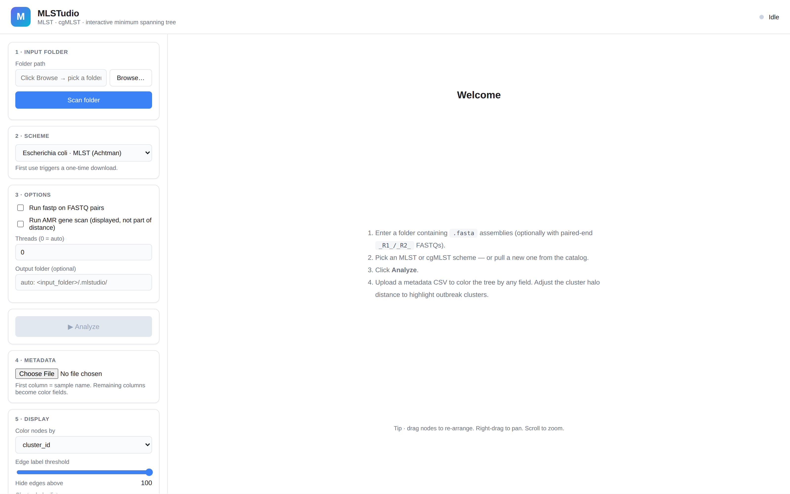
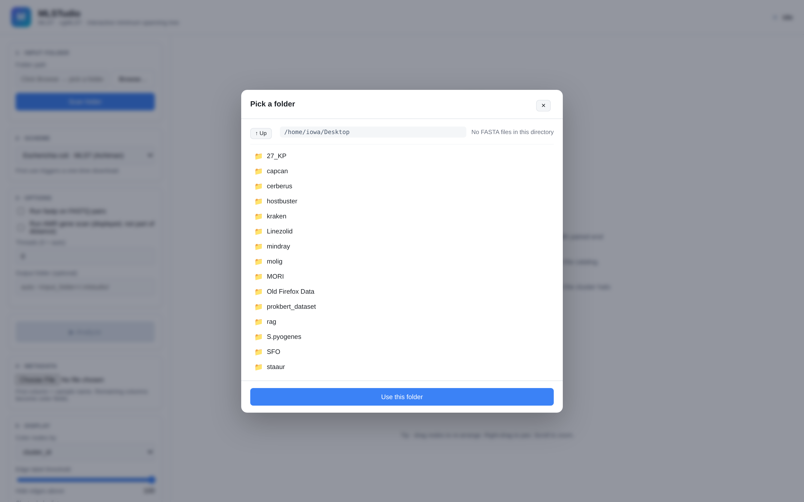
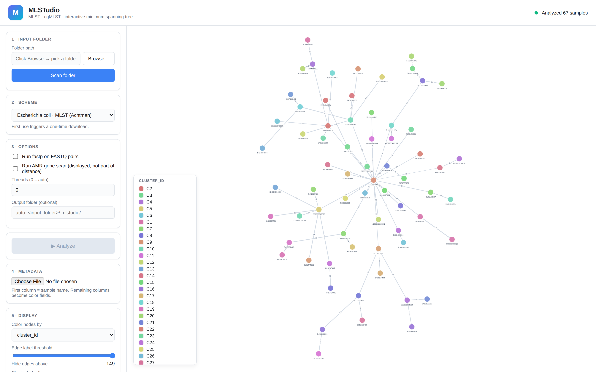
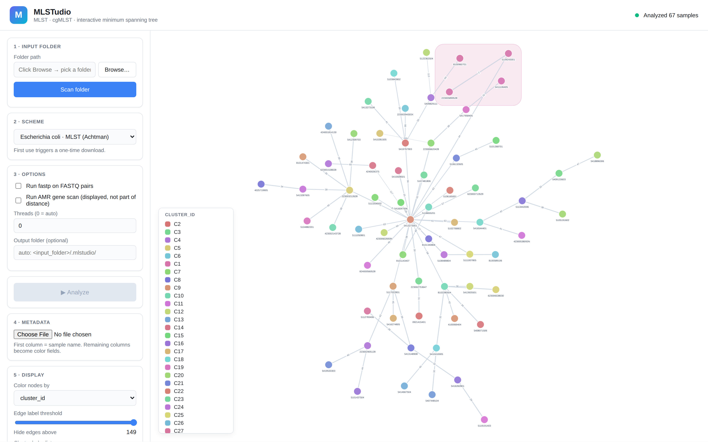
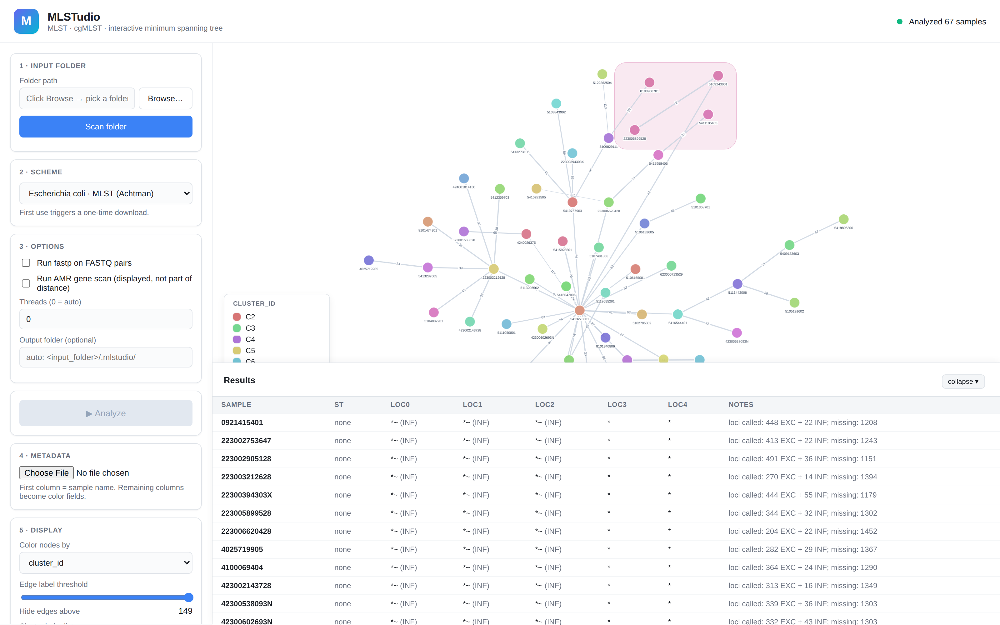

# MLSTudio

**Polished MLST / cgMLST typing for Linux with an interactive minimum spanning tree.**

Point it at a folder of assembled bacterial genomes, pick a scheme, and explore the population structure in your browser. Soft pastel clusters, drag-to-rearrange nodes, threshold-driven cluster halos, metadata-driven coloring, publication-quality export.

[Skip to the 60-second quickstart →](#60-second-quickstart)

---

## Screenshots

### 1. Welcome

The starting view. The sidebar walks you through five steps: pick a folder, pick a scheme, set options, run, and adjust the display.

### 2. Built-in folder browser

Click **Browse…** to navigate your filesystem from inside the browser — no need to type long paths. It tells you how many FASTA files are in each folder before you commit.

### 3. The minimum spanning tree

A 67-isolate *Staphylococcus aureus* cgMLST tree (1716 loci). Each node is one isolate; edge labels are the pairwise allele difference. Nodes are colored automatically by cluster — soft pastels chosen for legibility, with a legend in the corner. Drag any node to rearrange. Scroll to zoom. Right-click drag to pan.

### 4. Cluster halos

Set a **cluster halo distance** in the sidebar (default per-scheme — e.g. **5** for *S. aureus* cgMLST) and groups of isolates within that allele-difference get a soft pastel halo. Useful for outbreak investigation, where clones cluster within a few allele differences.

### 5. Results table

Per-isolate Sequence Types, per-locus allele calls, EXC/INF/LNF flags, and free-text notes. Scrollable, sortable, and exported alongside the tree.

---

## 60-second quickstart

```bash
# 1. Clone
git clone https://github.com/iowa69/mlstudio.git && cd mlstudio

# 2. Bootstrap (creates a conda env with BLAST+, fastp, samtools, seqkit, Python deps)
./setup.sh

# 3. Activate and launch the UI
conda activate mlstudio
mlstudio gui          # opens http://127.0.0.1:<port>/ in your default browser
```

A browser window opens. From there:

1. **Browse** to a folder containing your `.fasta` assemblies (and optionally paired-end `_R1_/_R2_` FASTQs).
2. **Pick a scheme** from the dropdown. First use pulls and caches it from the public scheme database (PubMLST or BIGSdb-Pasteur).
3. (Optional) **Upload a metadata CSV** — first column = sample name, other columns become color fields.
4. Click **Analyze**. Progress streams in real-time over WebSocket.
5. When the run finishes, the MST renders. Slide the **cluster halo distance** to highlight outbreak clusters, change **Color nodes by** to any uploaded metadata field, and **Export PNG** when you're ready.

## How to organize your input folder

A folder you point MLSTudio at can be FASTA-only or FASTA + paired-end Illumina reads:

```
my_run/
├── isolate_001.fasta
├── isolate_001_R1.fastq.gz   ← optional, paired with isolate_001.fasta
├── isolate_001_R2.fastq.gz   ← optional
├── isolate_002.fasta         ← FASTA-only is fine
└── isolate_003.fna           ← .fa / .fna / .fasta all recognized
```

**Paired-end naming patterns recognized**: `_R1_/_R2_`, `_1./_2.`, `.R1./.R2.`, `.1.fastq/.2.fastq`. The sample name is the FASTA stem (stripped of `.contigs`, `.scaffolds`, `.assembly`, `.genomic`, `.asm` suffixes).

## Available schemes

The catalog (panel 6 in the sidebar) lists every scheme MLSTudio knows about. Click **Pull** next to one to cache it locally. Currently registered:

| Organism | Scheme | Source | Loci | Suggested cluster distance |
|----------|--------|--------|:---:|:---:|
| *Listeria monocytogenes* | MLST | BIGSdb-Pasteur | 7 | 0 |
| *Listeria monocytogenes* | cgMLST1748_v2 | BIGSdb-Pasteur | 1748 | 7 |
| *Staphylococcus aureus* | MLST | PubMLST | 7 | 0 |
| *Staphylococcus aureus* | cgMLST | PubMLST | 1716 | 5 |
| *Escherichia coli* | MLST (Achtman) | PubMLST | 7 | 0 |
| *Klebsiella pneumoniae* | MLST | BIGSdb-Pasteur | 7 | 0 |

Adding more schemes is a one-line edit to `src/mlstudio/schemes/bigsdb.py`'s `REGISTRY`.

## Working with the tree

| Action | How |
|--------|-----|
| Drag a node | Click and hold |
| Pan the canvas | Right-click drag |
| Zoom | Scroll wheel |
| Fit everything to screen | **Fit to screen** button |
| Hide edges above a distance | **Edge label threshold** slider |
| Group close isolates in a halo | **Cluster halo distance** field |
| Color by an uploaded field | **Color nodes by** dropdown |
| Toggle sample labels | **Show sample labels** checkbox |
| Export | **Export PNG** (high-DPI, white background) |

The visual parameters (node size, edge thickness, label visibility) auto-tune to dataset size — from a handful of isolates up to 5000+ — so the tree stays legible on screens from a laptop to a 4K display.

## Output files

Every analysis writes to `<input_folder>/.mlstudio/` (or your chosen output folder):

- `summary.tsv` — one row per sample: ST, EXC/INF/LNF counts, notes
- `alleles.tsv` — full per-locus allele matrix (when the scheme has ≤200 loci)
- `mst.json` — Cytoscape.js-ready MST graph for re-use elsewhere
- `amr.tsv` — AMRFinderPlus hits, if you enabled the AMR scan

## CLI usage (no GUI needed)

```bash
mlstudio --help
mlstudio schemes list --remote          # what's available
mlstudio schemes pull saureus_cgmlst    # download a scheme
mlstudio call mlst   --scheme saureus_mlst   --input my_genome.fasta
mlstudio call cgmlst --scheme saureus_cgmlst --input my_genome.fasta -t 24
mlstudio gui /path/to/folder            # launch the UI, pre-filled
```

## Optional: AMR gene scanning

If you tick **Run AMR gene scan** in the sidebar, MLSTudio runs AMRFinderPlus alongside typing. Results are *displayed* in a separate column but **never contribute to the cgMLST allele-difference distance** — exactly as a clinician would want for outbreak investigation.

AMRFinderPlus must be installed (`conda install -c bioconda ncbi-amrfinderplus` and `amrfinder -u`) and is not pulled by default.

## Architecture

```
┌────────────────────────────────────────────────────────┐
│  Browser (Cytoscape.js)                                │
│   ├─ MST viewer with cluster halos                     │
│   ├─ Folder browser modal                              │
│   ├─ Profile / metadata tables                         │
│   └─ Scheme catalog                                    │
└──────────────────────────┬─────────────────────────────┘
                           │  HTTP + WebSocket (localhost)
┌──────────────────────────▼─────────────────────────────┐
│  FastAPI server (mlstudio.api)                         │
│   ├─ schemes/   PubMLST + BIGSdb-Pasteur clients       │
│   ├─ calling/   MLST · cgMLST · fastp                  │
│   ├─ amr/       AMRFinderPlus wrapper                  │
│   ├─ profiles/  Hamming distance + MST                 │
│   └─ io/        folder scanner, FASTQ pairing          │
└──────────────────────────┬─────────────────────────────┘
                           │  subprocess
                ┌──────────▼──────────┐
                │  BLAST+ · fastp     │
                │  samtools · seqkit  │
                └─────────────────────┘
```

cgMLST scales to 1000+ loci via a **single concatenated BLAST database** per scheme: one BLAST call per genome instead of one per locus, then results grouped by locus identifier. With 24 cores, 67 *S. aureus* genomes against the 1716-locus scheme finishes in ~25 minutes.

## Tested on

- *S. aureus* cgMLST (1716 loci) on 67 clinical isolates → 27+ distinct clusters identified at distance 5
- *L. monocytogenes* MLST (7 loci) on reference assemblies → correct STs (EGD-e ST 35, 10403S ST 85, F2365 ST 1)

## What's planned

- [ ] Bowtie2 read-backed rescue for missing/spurious alleles
- [ ] Species auto-detection from the assembly (BLAST against all cached scheme allele DBs in parallel)
- [ ] SVG export
- [ ] Pie-chart composite nodes when grouping by metadata field
- [ ] Bioconda package + AppImage

## License

MIT — see [LICENSE](LICENSE).

Built by [@iowa69](https://github.com/iowa69).
